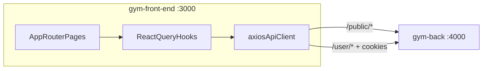
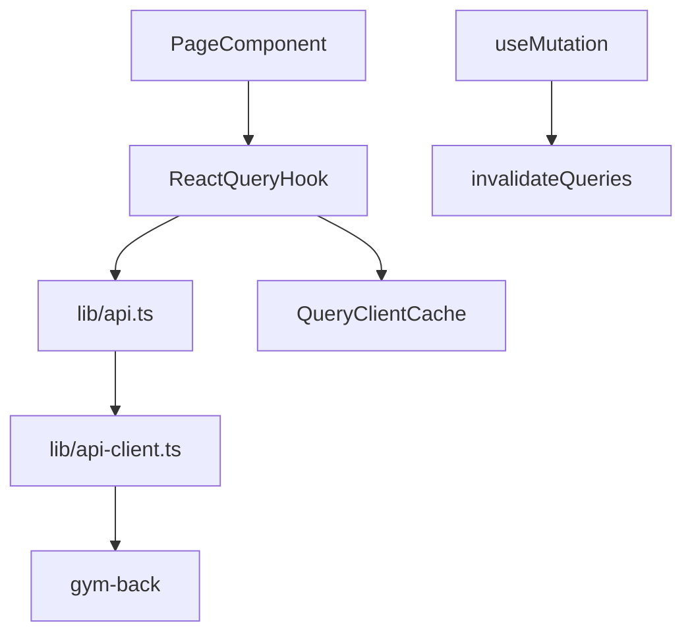

# Gym Storefront (gym-front-end)

Customer-facing e-commerce storefront for a gym/supplements brand. Part of the gym e-commerce platform alongside [gym-back](../gym-back) (API) and [gym-admin](../gym-admin) (admin dashboard).

This is intentionally more than a product grid with a cart: cookie-based sessions (no tokens in `localStorage`), CSRF-aware mutations, guest-to-customer cart merge, URL-driven catalog filters, dynamic theming from backend site settings, and a split hook layer over `/public/*` and `/user/*` APIs.

The UI uses the **Crimson Forge** theme with branding loaded from `GET /public/site-settings`.

---

## Platform overview



**Recommended startup order:** PostgreSQL → [gym-back](../gym-back) → this app.

| Service | Default URL |
|---------|-------------|
| Backend API | `http://localhost:4000/api/v1` |
| Storefront (this repo) | `http://localhost:3000` |
| Admin dashboard | `http://localhost:5173` |

Backend must include `http://localhost:3000` in `ALLOWED_ORIGINS` so credentialed requests work.

---

## Why this isn’t “just a simple storefront”

| Area | What the frontend actually does |
|------|----------------------------------|
| **No BFF layer** | Browser calls [gym-back](../gym-back) directly — no Next.js API routes or server proxy. |
| **Session model** | Customer JWT lives in **HttpOnly cookies** set by the backend; the client never stores tokens in `localStorage`. |
| **CSRF on mutations** | Axios interceptor reads `XSRF-TOKEN` cookie and sends `x-xsrf-token` on `POST`/`PUT`/`PATCH`/`DELETE`. See [`lib/api-client.ts`](lib/api-client.ts). |
| **Guest commerce** | Cart and wishlist work before login via backend `guestToken` cookies; login/register silently merge guest state. |
| **Route protection** | Account area uses client-side session check (`GET /user/auth/me`) with redirect to `/login?redirect=...`. See [`app/account/layout.tsx`](app/account/layout.tsx). |
| **Catalog UX** | Filters, search, sort, and pagination are **URL-driven** (`useFilterParams`) so listings are shareable and back-button friendly. |
| **Dynamic branding** | Site name, logos, colors, favicon, and meta tags are applied at runtime from backend settings. See [`stores/site-settings-store.ts`](stores/site-settings-store.ts). |
| **Typed API layer** | All responses unwrap `{ success, message, data }`; errors become `ApiError` with status. See [`lib/api.ts`](lib/api.ts), [`types/api.types.ts`](types/api.types.ts). |

---

## Authentication & security (how it works)

This app pairs with the customer auth model documented in [gym-back/README.md](../gym-back/README.md#customer-storefront-users).

### Customer session (cookie-based)

1. **Login / register** (`POST /user/auth/login`, `POST /user/auth/register`) — backend sets HttpOnly JWT cookies (`customer_access_token`, refresh token). The frontend only stores the **session profile** in React Query cache after `GET /user/auth/me`.

2. **Session check** — `useCustomerSession()` calls `GET /user/auth/me` with `withCredentials: true`. Used by account layout and header UI. Query key: `["customer-session"]`, `retry: false`, 5-minute stale time.

3. **Logout** — `POST /user/auth/logout` clears cookies server-side; client clears session cache and invalidates cart/wishlist queries.

4. **Protected routes** — `app/account/layout.tsx` redirects to `/login?redirect=<current-path>` when session is missing or `/me` fails. No Next.js middleware — protection is client-side after hydration.

5. **Post-login merge** — after successful login/register, the app calls `POST /user/cart/merge` and `POST /user/wishlist/merge` so guest items carry over. See [`app/login/page.tsx`](app/login/page.tsx), [`app/register/page.tsx`](app/register/page.tsx).

**What we deliberately avoid:** storing JWTs in `localStorage`/`sessionStorage`, passing tokens in URL params, or building a custom auth refresh loop on the storefront (refresh is handled by backend cookies when needed).

### CSRF (mutating requests)

[`lib/api-client.ts`](lib/api-client.ts) attaches CSRF on unsafe HTTP methods:

```typescript
// Reads XSRF-TOKEN cookie → sets x-xsrf-token header on POST/PUT/PATCH/DELETE
```

This mirrors the backend double-submit pattern. In development CSRF may be relaxed on the API; in production both cookie and header must match.

### Guest cart & wishlist

- First cart/wishlist API call establishes a **`guestToken`** cookie on the backend (via `GuestTokenMiddleware`).
- All cart/wishlist requests use `withCredentials: true` so the guest identity persists across tabs.
- On login, merge endpoints combine guest and customer data without user-facing steps.

### CORS & credentials

Axios is configured with `withCredentials: true` on every request. The storefront origin must be listed in backend `ALLOWED_ORIGINS`. Mutations send `Content-Type: application/json` plus CSRF header when the cookie is present.

---

## Commerce flows

### Cart

| Step | Hook / endpoint | Notes |
|------|-----------------|-------|
| Load cart | `useCart()` → `GET /user/cart` | 30s stale time |
| Add item | `useAddToCart()` → `POST /user/cart/items` | Supports `variantId`, `buyNow` |
| Update qty / selection | `useUpdateCartItem()` → `PATCH /user/cart/items/:id` | |
| Remove / clear | `useRemoveCartItem()`, `useClearCart()` | |
| Merge after auth | `mergeCart()` → `POST /user/cart/merge` | Called on login/register |

Cart **drawer open state** is UI-only Zustand ([`stores/cart-store.ts`](stores/cart-store.ts)); cart **data** always comes from the API.

### Checkout

| Step | Hook / endpoint | Notes |
|------|-----------------|-------|
| Shipping options | `useShippingMethods()` → `GET /user/checkout/shipping-methods` | |
| Payment options | `usePaymentMethods()` → `GET /user/checkout/payment-methods` | |
| Price preview | `usePreviewCheckout()` → `POST /user/checkout/preview` | Coupon + shipping |
| Place order | `usePlaceOrder()` → `POST /user/checkout/place-order` | Invalidates cart on success |

Checkout requires an authenticated customer session and saved address selection on the checkout page.

### Wishlist

Same pattern as cart: `useWishlist()`, add/remove hooks, `mergeWishlist()` after auth. Endpoints under `/user/wishlist`.

### Orders, returns, reviews

- **Orders:** `useCustomerOrders()`, `useCustomerOrder()` — `/user/orders`
- **Returns:** `useCreateReturn()` — `POST /user/orders/:orderId/returns`
- **Reviews:** `useCreateReview()` — `POST /user/reviews` (also from order detail)

---

## Data fetching architecture



**Global defaults** ([`app/providers.tsx`](app/providers.tsx)): `staleTime: 60_000`, `retry: 1`.

**Hook modules** (`hooks/api/storefront/`):

| File | Domain | API prefix |
|------|--------|------------|
| `use-public-products.ts` | Product listing | `/public/products` |
| `use-public-product.ts` | Product detail | `/public/products/:slug` |
| `use-public-categories.ts` | Categories | `/public/categories` |
| `use-public-brands.ts` | Brands | `/public/brands` |
| `use-public-collections.ts` | Collections | `/public/collections` |
| `use-public-banners.ts` | Homepage banners | `/public/banners` |
| `use-public-reviews.ts` | Product reviews (read) | `/public/products/:id/reviews` |
| `use-customer-auth.ts` | Login, register, profile | `/user/auth` |
| `use-cart.ts` | Cart CRUD + merge | `/user/cart` |
| `use-wishlist.ts` | Wishlist CRUD + merge | `/user/wishlist` |
| `use-checkout.ts` | Checkout flow | `/user/checkout` |
| `use-customer-addresses.ts` | Address CRUD | `/user/addresses` |
| `use-customer-orders.ts` | Order history | `/user/orders` |
| `use-customer-returns.ts` | Returns | `/user/orders/:id/returns` |
| `use-customer-reviews.ts` | Submit reviews | `/user/reviews` |

**Forms:** react-hook-form + zod resolvers on login, register, checkout, profile, addresses, contact.

**Catalog filters:** [`hooks/use-filter-params.ts`](hooks/use-filter-params.ts) syncs `search`, `categorySlug`, `brandSlug`, price range, rating, sort, and page to URL search params.

---

## Dynamic site settings

On app load, [`SiteSettingsHydrator`](components/site-settings-hydrator.tsx) fetches `GET /public/site-settings` once and:

- Applies CSS variables `--primary`, `--primary-hover` from admin-configured colors
- Sets document title, meta description/keywords, favicon
- Falls back to **Crimson Forge** defaults if the API is unreachable

Header/footer read from [`useSiteSettingsStore`](stores/site-settings-store.ts) for logos, contact info, and site name.

---

## Project organization

```
app/
├── layout.tsx              # Root layout: Lexend font, dark theme, Providers, SiteShell
├── providers.tsx           # QueryClient, site settings, cart drawer, toasts, smooth scroll
├── page.tsx                # Homepage
├── products/               # Catalog + PDP
├── categories/[slug]/      # Category-filtered listing
├── brands/[slug]/          # Brand-filtered listing
├── cart/, checkout/, wishlist/
├── login/, register/, contact/
└── account/                # Auth-guarded customer area (layout.tsx)

components/
├── ui/                     # shadcn primitives
├── layout/                 # SiteHeader, SiteFooter, SiteShell
├── home/                   # Homepage sections
├── products/               # Catalog grid, filters, PDP, wishlist button
└── cart/                   # CartDrawer

hooks/
├── api/storefront/         # React Query hooks (one file per API domain)
└── use-filter-params.ts    # URL-synced catalog filters

lib/
├── api-client.ts           # Axios + CSRF + error normalization
├── api.ts                  # Typed GET/POST/PATCH/DELETE wrapper
└── utils.ts, format-price.ts

stores/
├── site-settings-store.ts  # Branding + theme from backend
└── cart-store.ts           # Drawer open/close UI state only

types/                      # API envelopes, cart, customer, storefront types
config/index.ts             # NEXT_PUBLIC_API_URL
```

**Images:** Cloudinary URLs allowed in [`next.config.ts`](next.config.ts) (`res.cloudinary.com`).

**No Next.js middleware or API routes** — all data and auth go through gym-back.

---

## Routes

| Route | Description |
|-------|-------------|
| `/` | Homepage (banners, categories, featured products) |
| `/products` | Catalog with URL filters |
| `/products/[slug]` | Product detail (variants, reviews, add to cart) |
| `/categories/[slug]` | Category-filtered products |
| `/brands/[slug]` | Brand-filtered products |
| `/cart` | Full cart page |
| `/checkout` | Checkout (auth required in practice) |
| `/wishlist` | Wishlist |
| `/login`, `/register` | Auth + guest merge |
| `/contact` | Contact form → `POST /public/contact` |
| `/account` | Overview (auth required) |
| `/account/profile` | Profile and password |
| `/account/addresses` | Address CRUD + default |
| `/account/orders` | Order history |
| `/account/orders/[orderId]` | Detail, reviews, returns |

---

## Tech stack

| Layer | Choice |
|-------|--------|
| Framework | Next.js 16 (App Router) |
| Language | TypeScript |
| UI | React 19, Tailwind CSS 4, shadcn/ui, `@base-ui/react` |
| Data fetching | TanStack React Query 5, axios |
| Forms | react-hook-form, zod |
| Client UI state | Zustand (cart drawer, site settings) |
| Animation | Motion, Lenis smooth scroll |
| Icons / toasts | lucide-react, sonner |

---

## Environment variables

| Variable | Purpose | Default |
|----------|---------|---------|
| `NEXT_PUBLIC_API_URL` | Backend API base URL | `http://localhost:4000/api/v1` |

```bash
cp .env.example .env.local
```

---

## How to run

**Prerequisites:** Node.js 20+, [pnpm](https://pnpm.io/), [gym-back](../gym-back) running with PostgreSQL and Cloudinary configured.

```bash
pnpm install
cp .env.example .env.local
pnpm dev
```

Open [http://localhost:3000](http://localhost:3000).

**Production:**

```bash
pnpm build
pnpm start
```

### Scripts

| Script | Command | Purpose |
|--------|---------|---------|
| `dev` | `next dev` | Development server |
| `build` | `next build` | Production build |
| `start` | `next start` | Serve production build |
| `lint` | `eslint` | Lint |
| `stitch:fetch-product-list` | `node scripts/fetch-stitch-screen.mjs` | Fetch Stitch design screen |

---

## API reference

Detailed storefront paths and query params: [gym-back/docs/storefront-api-paths.md](../gym-back/docs/storefront-api-paths.md).

Backend auth, guest tokens, and CSRF rules: [gym-back/README.md](../gym-back/README.md).
